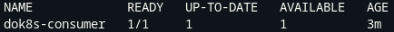
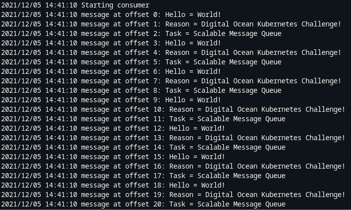
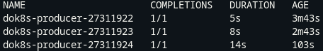
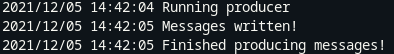

# DigitalOcean Kubernetes Challenge

## Task: Scalable Message Queue

Here we are using `strimzi` to deploy Kafka onto Kubernetes.
Our `producer_consumer.go` is an application which can both write and read from the broker, depending on the environment variable that is passed to the container; there is a choice between `CONSUMER` and `PRODUCER` for the `DOK8S_ROLE` variable.

## Setup

Kubernetes cluster is provisioned using `terraform`, to get this up and running, use the following commands. This relies on you having an exported `DIGITALOCEAN_TOKEN` within your environment variable for access.

    cd terraform && terraform apply --auto-approve

This will provision the cluster with a single worker node.

Install the `strimzi` operator for running a Kafka cluster on Kubernetes.

    doctl kubernetes cluster kubeconfig save <cluster-id>
    # You can get this full command from the DigitalOcean Kubernetes UI.

    ./terraform/strimzi-install/install.sh

## Walkthrough

Our cluster is initially provisioned using `terraform`, using the steps outlined above. This will also install the `strimzi` Kafka operator onto the cluster so that we can start reading/writing from topics.

Now we have our cluster available and the kube config file saved to our local machine, we can install our particular application onto it to produce and consume some data.

    kubectl apply -f manifests/app.yaml

This will install the containerised `producer_consumer.go` application, which is available on `docker.io`, onto the cluster. It includes two things:
* A `Deployment` of the application acting as a consumer from the broker.
* A `CronJob` of the application, this runs every minute producing messages into the specified topic. 

To confirm that the deployment was successful for the consumer, run the following command

    kubectl get deployments

You should see the something resembling that of below

After, we should check the logs for our consumer, since this is running in our `Deployment` object. You can do this by running

    kubectl logs dok8s-consumer-<id>

If the pod is running correctly, you should see something similar to

_Note: We see a number of logs here as the producer job has ran multiple times in this case._

From here, we can assume that the producer is running, since we are seeing messages being picked up by the consumer. However, to confirm this we can run

    kubectl get jobs

Your output should look something like

Finally, we can check a random pod that has ran under the `CronJob` resource and see the logs that it produced. Using the `dok8s-producer-27311922` pod, we can do the following

    kubectl logs dok8s-producer-<id>

This should show us the output from our producer, as below. This will be the same for however many producer jobs have ran.

**This confirms that our producer is writing to a topic which has been created within Kafka and our consumer is able to read the messages from that said topic.**